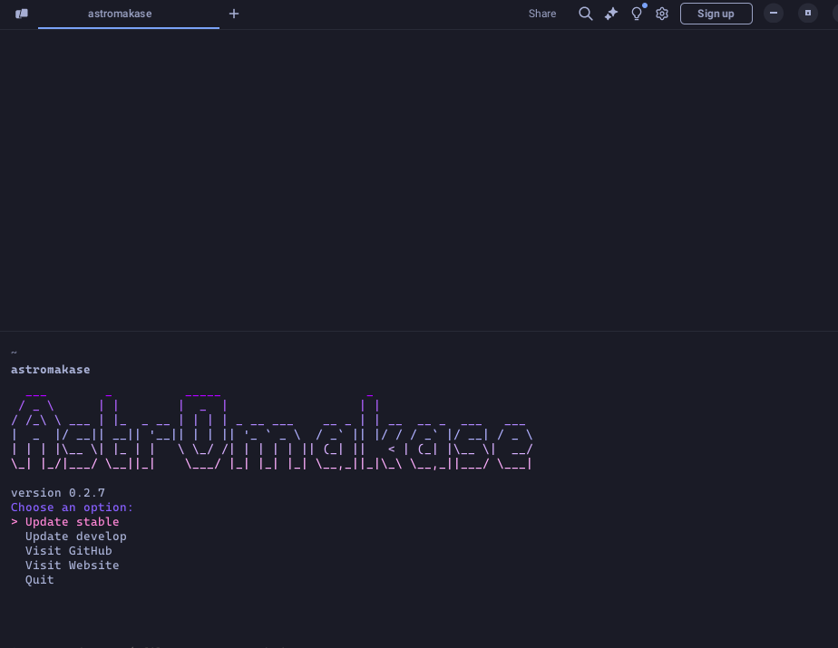

### AstrOmakase


**AstrOmakase** is a research and astronomy-oriented software suite designed for astronomers and astrophysicists. The project provides a tailored setup with tools and configurations relevant to astronomy, allowing users to focus on their research without worrying about software configuration.

AstrOmakase was inspired by the [Omakub project](https://github.com/basecamp/omakub), which provided a foundation for customising software setups. While AstrOmakase is now an independent project, we acknowledge and thank the Omakub team for their initial influence and inspiration.

Similar to Omakub, the name AstrOmakase is derived from "astronomy" and the Japanese word "omakase," which means "I'll leave it up to you." In Japanese cuisine, omakase is a style of dining where the chef selects and prepares the meal, offering a curated and customised experience. Similarly, AstrOmakase provides a streamlined setup optimised for astronomy research.


### The Menu

Here is a list of tools included in AstrOmakase:

#### General Tools

- **Anaconda**: A powerful distribution for Python and R programming languages, widely used for scientific computing. Anaconda installation includes popular data science libraries such as **NumPy**, **SciPy**, and **Matplotlib**.
- **Chrome browser**: A fast, secure, and easy-to-use web browser.
- **Docker**: A containerisation platform that allows developers to package and run applications in isolated environments, ensuring consistent behaviour across different systems.
- **Flameshot**: A powerful yet simple-to-use screenshot tool.
- **GitHub CLI**: gh is GitHub on the command line.
- **GIMP**: GNU Image Manipulation Program, a versatile graphics editor.
- **Gnome-sushi**: A quick previewer for files in GNOME.
- **HDFCompass**: A tool for browsing and analysing HDF5 data.
- **Kdiff3**: A diff and merge program for comparing files and directories.
- **krita**: A professional free and open-source painting program.
- **OBS Studio**: A free and open-source software for video recording and live streaming.
- **OnlyOffice**: An office suite for document editing, project management, and CRM compatible with Microsoft Office.
- **Okular**: A document viewer for PDF, PostScript, DjVu, and other formats.
- **PDFsam**: A tool to split and merge PDF files.
- **Precommit**: A framework for managing and maintaining multi-language pre-commit hooks.
- **qBTorrent**: A BitTorrent client for downloading files.
- **rSync**: A utility for efficiently transferring and synchronising files.
- **rClone**: A command-line program to manage files on cloud storage.
- **Ulauncher**: A fast and lightweight application launcher for Linux, supporting extensions and fuzzy search.
- **VLC Media Player**: A versatile media player that can play most multimedia files and streaming protocols.
- **VSCode**: A versatile and complete coding IDE.
- **Xournal++**: A PDF editor and note-taking application.
- **Zed**: A high-performance, multiplayer code editor.

### Console Emulator

**Warp** terminal is pre-configured with the **Tokyo Night** theme to provide a modern and optimised command-line experience.

### Console Tools

- **fastfetch**: A fast system information tool written in Rust.
- **fd**: A simple, fast, and user-friendly alternative to `find`.
- **htop** and **btop**: Two interactive process viewers for Unix systems.
- **lt (eza)**: A tool for listing files and directories in a tree-like format.
- **nmap**: A network exploration tool and security scanner.
- **pavucontrol**: A volume control tool for PulseAudio.
- **plocate**: A tool for quickly locating files on the filesystem.
- **screen**: A terminal multiplexer that allows multiple windows within a single terminal session.
- **zoxide**: A fast, flexible, and smart directory jumper.

#### Astronomy Tools

- **SAOImage DS9**: An astronomical imaging and data visualisation application.
- **Stellarium**: A planetarium software that shows exactly what you see when you look up at the stars.
- **Zotero**: A reference management tool for organising research papers and citations.

Additionally, some tools not commonly used in the astronomy field have been excluded to streamline the setup.

#### Optional Tools

- **Brave Browser**: A privacy-focused web browser that blocks ads and trackers.
- **Discord**: A communication platform for chat and voice, useful for collaborative projects.
- **Dropbox**: Cloud storage service for easy file sharing and backup.
- **Franz**: A messaging app that combines multiple chat services into one application.
- **gdm-settings**: A tool for customising GNOME Display Manager settings.
- **LaTeX Studio**: A comprehensive LaTeX editor for creating scientific documents.
- **NordVPN**: A secure VPN service for protecting your online privacy.
- **remmina**: A remote desktop client for accessing remote desktops.
- **ScrCPy**: A screen mirroring application for Android devices.
- **Slack**: A collaboration hub that connects teams.
- **SuperPaper**: A multi-monitor wallpaper manager.
- **Speedtest**: A tool for testing internet speed.
- **Zoom**: A video conferencing tool for meetings and webinars.
- **Upscayl**: A tool for upscaling images using AI.

#### Font Configuration

AstrOmakase leverages the **Inter Font** Family for its sleek, modern design and outstanding readability on digital displays. Inter is carefully optimised for screen usage, providing a clean and professional aesthetic that enhances the overall user experience. To complement this, AstrOmakase adopts **Cascadia Code Nerd** Font for terminal and monospace applications, ensuring a clear and visually appealing interface for developers and researchers working with code. This combination strikes a perfect balance between elegance and functionality.

### Installation

Run the script below to install AstrOmakase on your Ubuntu 24.04 system:

```bash
wget -qO- https://mug-n-ai.github.io/AstrOmakase/installer.sh | bash
```

### Updates

AstrOmakase can be easily updated from the dedicated executable:



The app also shows the installed version. The user can launch the application from the console by running `astromakase`, or using the dedicated launcher.

### Contributions

We welcome contributions! To contribute, follow these steps:

1. Fork the repository.
2. Create a new branch for your feature (`git checkout -b feature/feature-name`).
3. Commit your changes (`git commit -m 'Add feature'`).
4. Push the branch (`git push origin feature/feature-name`).
5. Open a [Pull Request](https://docs.github.com/en/pull-requests/collaborating-with-pull-requests/proposing-changes-to-your-work-with-pull-requests/about-pull-requests).
